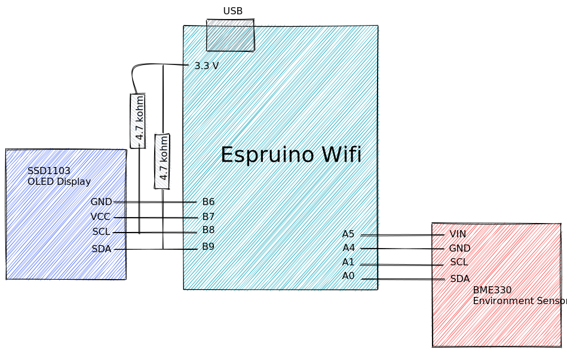
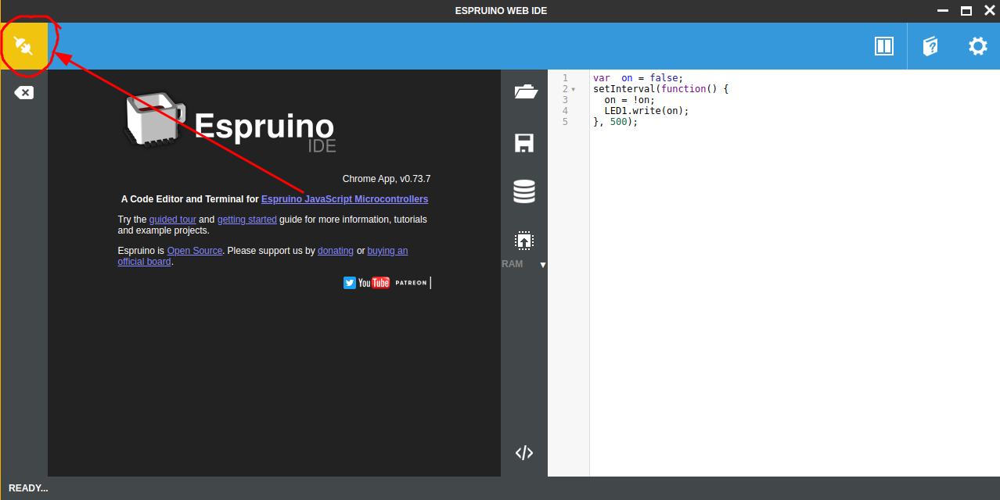
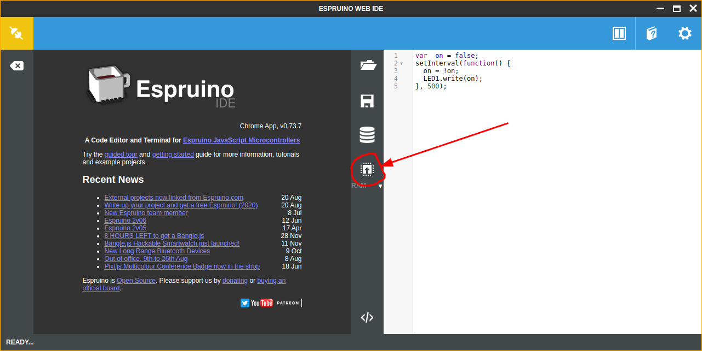

# Espruino Weather Station

[Espruino](https://www.espruino.com/) is a project that combines small, powerful, and efficient microcontrollers with a JavaScript runtime.

For this course, we will use an [Espruino Wifi](https://www.espruino.com/WiFi), a [BME280 Environment Sensor](https://www.espruino.com/BME280) (temperature, humidity, and atmospheric pressure), and a [SSD1306 OLED](https://www.espruino.com/SSD1306) display.

The components are combined as illustrated below:

**CPINFO Espruino Circuit Diagram**

## 1 Get Connected

1. Connect your Espruino board to the USB port of the computer. Wait for Windows to indicate the drivers were correctly installed.
1. Install the [Espruino Web IDE](https://chrome.google.com/webstore/detail/espruino-web-ide/bleoifhkdalbjfbobjackfdifdneehpo) and open it.
1. Connect to your Espruino board by clicking on connect icon and choosing the `Espruino` connection:
   
1. Click on the Run button to execute the code that is shown on the right half of the screen:
   

   You can modify the code on the right half of the screen and then click the Run button again to see the changes live. You can also execute `console.log("hello CPINFO")` to log messages and data to the console of the left half of the screen.

## 2 OLED Display

The SSD1306 OLED is a 128x64 resolution monochrome OLED display. It communicates with the Espruino using a SPI protocol. Fortuneatly, this is already supported by Espruino.

1. Setup the display by adding the following code to your project:
    ```javascript
    let display;
    function setupDisplay() {
      I2C1.setup({scl: B8, sda: B9});
      B7.set();
      B6.reset();
      display = require('SSD1306').connect(I2C1, start);
    }

    setupDisplay();
    display.drawString("Hello CPINFO");
    display.flip();
    ```

   The graphics library on Espruino allows changing the font, drawing lines, shapes, and much more. **See details**

1. clear() and flip()

1. refresh with setInterval()


## 3 BME280 Environment Sensor

1. setup

1. get data and display

#### Exercise 3.1: use setInterval to read the temperature and update the display

#### Bonus: Graph library to draw cool graphs!!!

## 4 Wifi

## 5 Server

## Weather History
